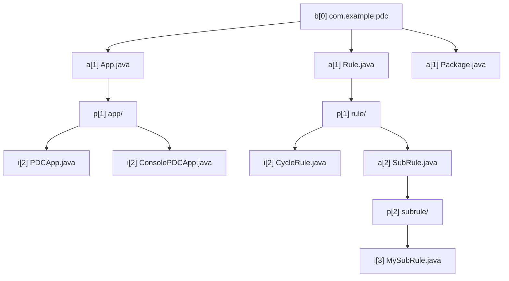

# Package Design Check (PDC)

**Ein OOP-konformes Tool zur Validierung von Paketstrukturen in Java-Projekten**


👉 Das Diagramm zeigt:  
- `b[0]` als Root-Namespace  
- Abstraktionen (`a[n]`) definieren die Hierarchie  
- Implementierungspakete (`p[n]`) hängen streng an den Abstraktionen  
- Implementierungen (`i[n]`) leben ausschließlich in ihren jeweiligen Paketen  


---


## **1. Fachliche Anforderungen**

### **1.1 Priorisierung der Fehler**
| Priorität | Fehlerart                     | Beispiel                                  |
|-----------|-------------------------------|-------------------------------------------|
| 🚨 KRITISCH | Zirkuläre Abhängigkeiten      | `A → B → A`                              |
| 🔴 HOCH     | Fehlende Domain-Pakete        | `Bill.java` ohne `com.example.billing.bill/` |
| 🔴 HOCH     | Pluralformen in Abstraktionen | `Rules.java` statt `Rule.java`           |
| 🟠 MITTEL   | Falsche Paketnamen           | `com.example.billing.Rules/` statt `rule/` |
| 🟠 MITTEL   | Leere Pakete                 | `com.example.billing.empty/` ohne Klassen |

---

### **1.2 Zyklenerkennung**
- **Direkte Zyklen**: `A → B → A`
- **Indirekte Zyklen**: `A → B → C → A`
- **Lösungsvorschläge pro Zyklus**:
  1. Extrahiere gemeinsame Schnittstelle
  2. Nutze Dependency Injection
  3. Restrukturiere Pakete nach Domain-Kontexten

---

## **2. Implementierungsanforderungen**

### **2.1 OOP-Namenskonventionen**
- **Keine "-er" Suffixes** (z. B. nicht `Validator`, sondern `Validation`)
- **Keine statischen Methoden** (Verhalten in Objekten gekapselt)
- **Immutable Objects** (Domain-Objekte sind unveränderlich)
- **Keine "Client"-Suffixes** (z. B. nicht `PackageClient`, sondern `Package`)

**Quellen**:
- [Seven Virtues of Good Objects](https://www.yegor256.com/2014/11/20/seven-virtues-of-good-object.html)
- [Objects End With "er"](https://www.yegor256.com/2015/03/09/objects-end-with-er.html)

---

### **2.2 Dependency Injection ohne Container**
- **Manuelle DI** (keine Frameworks wie Spring)
- **Composable Decorators** für erweiterbare Funktionalität
- **Vertikale Dekoration** für Domain-Logik
- **Horizontale Dekoration** für technische Aspekte

**Quellen**:
- [DI Containers Are Evil](https://www.yegor256.com/2014/10/03/di-containers-are-evil.html)
- [Composable Decorators](https://www.yegor256.com/2015/02/26/composable-decorators.html)

---
### 2.3 Paketstruktur-Regeln
Formale Ebenenzuordnung
**Notation**
b[n] = Namespace (Basisstruktur, „Box“), Ebene n
a[n] = Abstraktion, Ebene n
p[n] = Paket (Implementierungs-Container für a[n]), Ebene n
i[n] = Implementierung, Ebene n

**Beispielstruktur formalisiert**
```
b[0]  com.example.pdc
│
├── a[1]  App.java
├── p[1]  app/
│   ├── i[2]  PDCApp.java
│   └── i[2]  ConsolePDCApp.java
│
├── a[1]  Rule.java
├── p[1]  rule/
│   ├── i[2]  CycleRule.java
│   ├── a[2]  SubRule.java
│   └── p[2]  subrule/
│       └── i[3]  MySubRule.java
│
└── a[1]  Package.java
```

**Regeln für Ebenenzuordnung**

**Namespace-Regel (b[n])**
Es existiert genau ein Root-Namespace b[0], der die globale Ordnungsbasis bildet.
Darunter entstehen Abstraktionen und Pakete.

**Abstraktionsregel (a[n])**
Abstraktionen a[n] dürfen direkt im übergeordneten Namespace/Package existieren.
Abstraktionen definieren die Architektur-Hierarchie.
Jede Abstraktion a[n] ist Voraussetzung für die Existenz eines gleichnamigen Implementierungspakets p[n].

**Paketregel (p[n])**
Jedes Implementierungspaket p[n] darf nur existieren, wenn eine Abstraktion a[n] im selben Namespace oder einer höheren Ebene definiert ist.
p[n] enthält nur Implementierungen i[n+1] oder weitere Abstraktionen a[n+1].

**Implementierungsregel (i[n])**
Jede Implementierung i[n] ist strikt an eine Abstraktion a[n-1] gebunden.
Implementierungen können nur innerhalb von p[n-1] existieren.
Es gibt keine „freien Implementierungen“ außerhalb eines passenden Pakets.

---
### 2.3.1 Formale Definition der Paketstruktur
*Notation:*
- b[0]: Root-Namespace (Wurzel, immer Ebene 0)
Beispiel: com.example.pdc
- p[n]: Paket auf Ebene n (n ≥ 1)
Beispiel: com.example.pdc/rule/ (Ebene 1)
- a[n]: Abstraktion auf Ebene n (n ≥ 1)
Beispiel: com.example.pdc.Rule (Ebene 1)
- i[n]: Implementierung auf Ebene n (n ≥ 1)
Beispiel: com.example.pdc.rule.PackageRule (Ebene 1)
---
### 2.3.1 Paketstruktur Example
```
com.example.pdc/                # b[0] (Root-Namespace, Ebene 0)
├── App.java                    # a[1] (Abstraktion)
├── Rule.java                   # a[1] (Abstraktion)
├── app/                        # p[1] (Paket für App-Realisierungen)
│   ├── PDCApp.java             # i[1] (Implementierung von App)
│   └── ConsolePDCApp.java      # i[1] (Implementierung von App)
└── rule/                       # p[1] (Paket für Rule-Realisierungen)
    ├── PackageRule.java        # i[1] (Implementierung von Rule)
    ├── SubRule.java            # a[2] (Abstraktion)
    ├── subrule/                # p[2] (Paket für SubRule-Realisierungen)
    │   └── MySubRule.java      # i[2] (Implementierung von SubRule)
    └── CycleRule.java          # i[1] (Implementierung von Rule)

```

#### 2.3.2. Formale Regeln

**Regel 1:Paketentstehung** 
Pakete entstehen nur auf der Ebene von Abstraktionen und nur dann, wenn eine gleichnamige Abstraktion existiert:
```
∀n≥1:∃p[n]  ⟺  ∃a[n]∈b[k], wobei k=n−1\forall n \geq 1: \exists p[n] \iff \exists a[n] \in b[k], \text{ wobei } k = n-1∀n≥1:∃p[n]⟺∃a[n]∈b[k], wobei k=n−1
```
- b[0]: Root-Namespace (immer Ebene 0)
- a[n]: Abstraktion auf Ebene n (Interface oder abstrakte Klasse)
- p[n]: Paket auf Ebene n für Realisierungen von a[n]
  
**Regel 2: Namenskonventionen**
Der Paketname muss dem Namen der korrespondierenden Abstraktion entsprechen:
```
∀n≥1:Name(p[n])=Name(a[n]).toLowerCase()\forall n \geq 1: \text{Name}(p[n]) = \text{Name}(a[n]).\text{toLowerCase()}∀n≥1:Name(p[n])=Name(a[n]).toLowerCase()
```
**Beispiele:**
- Abstraktion (a[n])           --> Paket (p[n])
- com.example.pdc.Rule         --> com.example.pdc/rule/
- com.example.pdc.rule.SubRule --> com.example.pdc/rule/subrule/

**Regel 3: Paketinhalte**
Pakete dürfen nur Realisierungen ihrer gleichnamigen Abstraktion enthalten:
```
∀n≥1:∀i[n]∈p[n]:i[n]⪯a[n]\forall n \geq 1: \forall i[n] \in p[n]: i[n] \preceq a[n]∀n≥1:∀i[n]∈p[n]:i[n]⪯a[n]
```
- i[n]: Implementierung (konkrete Klasse) im Paket p[n]
- a[n]: Abstraktion auf Ebene n
- ⊑: "ist eine Realisierung von" (Implementierung, Vererbung oder Dekoration)

**Regel 4: Rekursive Struktur**
Die Regeln gelten rekursiv für alle Ebenen (n ≥ 1):
```
∀n≥1:Regeln 1-3 gelten fu¨r Ebene n\forall n \geq 1: \text{Regeln 1-3 gelten für Ebene } n∀n≥1:Regeln 1-3 gelten fu¨r Ebene n
```


## 4. Implementierung der Klassen


